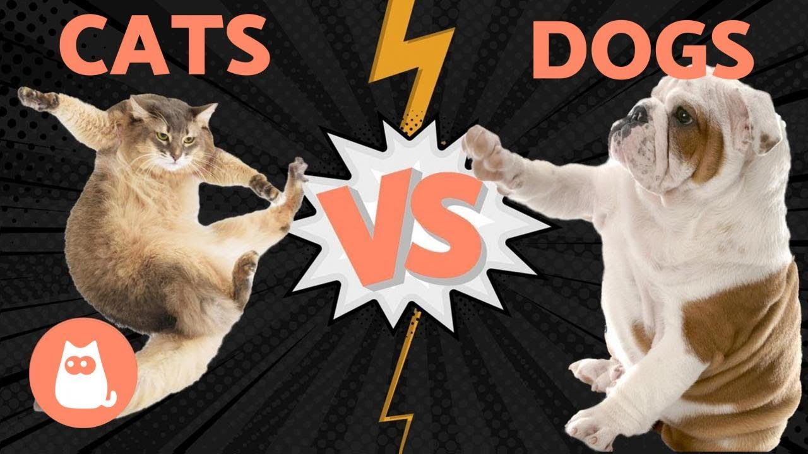

# DEBATE CLUB
 ## An Age Old Debate
# Cats VS Dogs 

## Which Pet Truly Makes for the Better Companion?
### Team cat: Mirdan Assi
[description here]

[quote]

### Team Dog: Taylor

Life-long dog lover and advocate.

Fur-Mom of 2 precious Doggos

"Cats are cute, but can they love you like dogs?

## Installation

TODO: Describe the installation process

## Usage

TODO: Write usage instructions

## Contributing

1. Fork it!
2. Create your feature branch: `git checkout -b my-new-feature`
3. Commit your changes: `git commit -am 'Add some feature'`
4. Push to the branch: `git push origin my-new-feature`
5. Submit a pull request :D

## History

TODO: Write history

## Credits

TODO: Write credits

## License

TODO: Write license