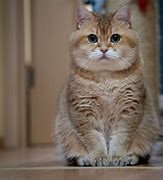

# DEBATE CLUB
 ## An Age Old Debate
# Cats VS Dogs 

## Which Pet Truly Makes for the Better Companion?
### Team cat: Mirdan Assi

Cats are my favourite animal

I like cats because they are funny and independent

Cats are cute and clean unlike dogs.

[quote]

### Team Dog: Taylor

Life-long dog lover and advocate.

Fur-Mom of 2 precious Doggos

"Cats are cute, but can they love you like dogs?

### Team cat: Mirdan Assi

Cats can love their owners more than dogs 

Cats always want to be pet by their owners

Moreover, cats do not ask their owners to take them for walks. They go for walks by themselves and come back home again. 

TODO: Describe the installation process

## Usage

TODO: Write usage instructions

## Contributing

1. Fork it!
2. Create your feature branch: `git checkout -b my-new-feature`
3. Commit your changes: `git commit -am 'Add some feature'`
4. Push to the branch: `git push origin my-new-feature`
5. Submit a pull request :D

## History

TODO: Write history

## Credits

TODO: Write credits

## License

TODO: Write license